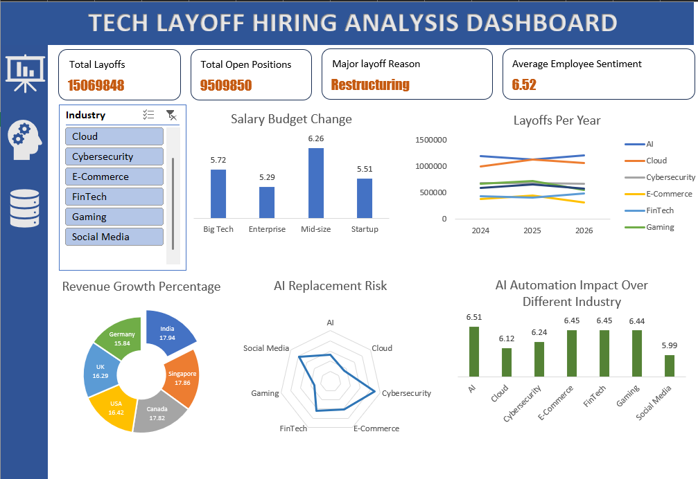

<div align="center">

# 🔍 Tech Layoff & Hiring Analysis Dashboard

### *Decoding the Great Tech Disruption — Layoffs, AI Risk, and What Comes Next*

[](https://www.microsoft.com/excel)
[]()
[]()
[]()

</div>

---

## 📊 Dashboard Preview



> *An interactive Excel dashboard synthesizing 60M+ layoff records across 7 tech sectors — built for clarity, built for decisions.*

---

## 🎯 Project Overview

The tech industry is undergoing one of its most turbulent restructuring waves in history. This project dives deep into **2998 layoff records** spanning **2024–2026** across 7 major tech industries to uncover patterns in workforce reduction, AI disruption risk, hiring sentiment, and salary budget shifts.

Whether you're a recruiter tracking talent pipelines, a job seeker reading the market, or a business analyst advising leadership — this dashboard turns complex workforce data into actionable intelligence.

---

## ✨ Key Insights at a Glance

| Metric | Value |
|---|---|
| 🏢 Total Layoffs Tracked | **15069848** |
| 💼 Total Open Positions | **9509850** |
| 🤖 Avg. AI Automation Impact Score | **6.5 / 10** |
| 📍 Primary Layoff Driver | **Restructuring** |
| 📅 Timeline | **2024 – 2026** |
| 🌍 Countries Analyzed | **6** (USA, India, UK, Canada, Germany, Singapore) |

---

## 🗂️ What the Dashboard Covers

### 📉 Layoffs Per Year by Industry
Tracks annual headcount reductions across **AI, Cloud, Cybersecurity, E-Commerce, FinTech, Gaming, and Social Media** — revealing which sectors are shrinking fastest and where the floor might be.

### 💰 Salary Budget Change by Company Size
Compares salary adjustment percentages across **Big Tech, Enterprise, Mid-size, and Startup** companies — critical for understanding compensation trends in a post-layoff market.

### 🌐 Revenue Growth by Country
A geographic breakdown of revenue growth percentages across 6 countries — showing where tech investment is flowing despite headcount cuts.

### 🤖 AI Replacement Risk Radar
A radar chart mapping how exposed each industry is to AI-driven role replacement — a forward-looking metric for both employers and employees.

### 📊 AI Automation Impact by Industry
Bar chart scoring each sector's automation vulnerability, helping identify which domains require the most urgent workforce reskilling.

### 🔎 Company-Level Search
Drill into any company to see its layoff count, open roles, and industry — enabling granular talent market analysis.

---

## 📁 Repository Structure

```
📦 tech-layoff-hiring-analysis
 ┣ 📊 tech_layoff_hiring_analysis.xlsx   ← Interactive Excel dashboard
 ┣ 📄 Dataset.csv                        ← Raw structured dataset
 ┣ 🖼️ dashboard.png                      ← Dashboard screenshot
 ┗ 📝 README.md                          ← You are here
```

---

## 🧠 Data Dimensions

The dataset spans multiple analytical layers:

- **Layoff Volume** — by industry and year (2024, 2025, 2026)
- **Salary Budget Changes** — by company size tier
- **Revenue Growth %** — by country (Canada 17.82%, Germany 15.84%, India 17.94%, Singapore 17.86%, UK 16.29%, USA 16.42%)
- **AI Replacement Risk Scores** — per industry (scale of 1–10)
- **Layoff Reasons** — AI Automation · Overhiring Correction · Restructuring · Cost Cutting · Market Slowdown
- **Company-Level Metrics** — individual layoff counts and open roles

---

## 🛠️ Tools & Techniques

| Tool | Usage |
|---|---|
| **Microsoft Excel** | Dashboard design, charts, slicers, pivot tables |
| **Power Query** | Data transformation and cleaning |
| **Advanced Charts** | Radar, bar, line, pie, and KPI cards |
| **Dynamic Slicers** | Industry-level filtering in real time |
| **Conditional Formatting** | Visual hierarchy and data callouts |

---

## 💡 Why This Project Stands Out

> **"Most layoff dashboards stop at the numbers. This one asks: what happens next?"**

- 📌 Combines **historical layoffs + future hiring signals** in one view
- 🤖 Quantifies **AI disruption risk** per industry — rare in public datasets
- 🌍 Adds **country-level revenue context** that most workforce analyses skip
- 🏢 Enables **company-specific drill-down** for targeted research
- 📐 Designed with recruiter and analyst workflows in mind

---

## 🚀 How to Use

1. **Clone or download** this repository
2. Open `tech_layoff_hiring_analysis.xlsx` in Microsoft Excel (2016 or later recommended)
3. Use the **Industry slicer** (left panel) to filter by sector
4. Explore the **KPI cards** at the top for macro-level signals
5. Search company-specific data using the **Company Name** input field

---

## 📬 Connect With Me

<div align="center">

If this project sparked ideas or you'd like to collaborate on data analytics work, let's connect!

[](www.linkedin.com/in/chirag-modi-3001rookie)
[](https://github.com/Rookie010101)
[](mailto:chiragmodi2027@gmail.com)

</div>

---

<div align="center">

⭐ **If you found this useful, drop a star — it helps others discover the project!** ⭐

*Built with curiosity, data, and a belief that every layoff statistic represents a real person's story.*

</div>
